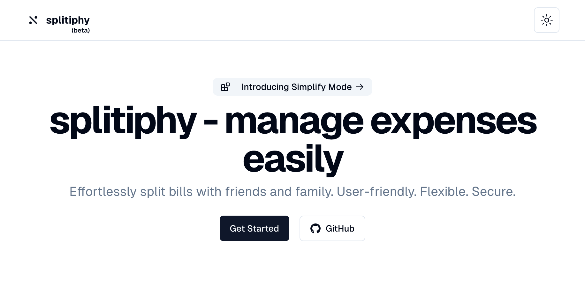

# Splitiphy Home Page



Splitiphy is a Modern Full Stack Web Application that allows users to easily split bills with friends and family. It is built with Next JS, Tailwind CSS, and Drizzle.

## Preview Link

✅ [Live] [https://splitiphy.vercel.app/] 😊

## Run Locally

Following steps are required to run the application:

- Open Terminal

- Clone Splitiphy Repository

```bash
    git clone https://github.com/iamsomraj/splitiphy.git
```

- Go to Root Directory of the Project

```bash
    cd splitiphy
```

- Setup Environment Variables

To run this project, you will need to add the following environment variables to your `.env` file

- `NEXT_PUBLIC_CLERK_PUBLISHABLE_KEY` - Clerk Publishable Key
- `CLERK_SECRET_KEY` - Clerk Secret Key
- `DATABASE_URL` - Database URL

- Install Dependencies

```bash
    pnpm install
```

- Run the Application

```bash
    pnpm run dev
```

## Developer

LinkedIn : [iamsomraj](https://www.linkedin.com/in/iamsomraj/) 😊

Portfolio: [Somraj Mukherjee](https://iamsomraj.github.io/) 😊

## Show Your Support

Give me a star ⭐

if this project helped you 👦 👧

## License

[GNU General Public License v3.0](https://www.gnu.org/licenses/gpl-3.0.html)
