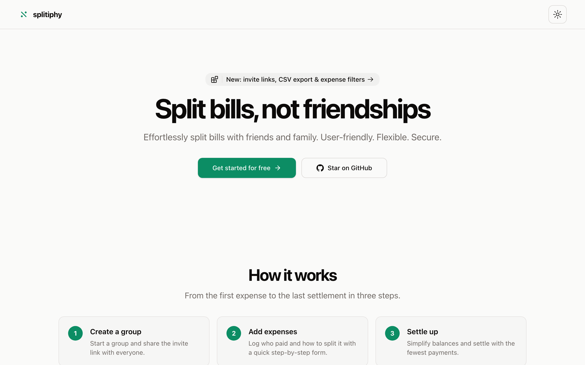
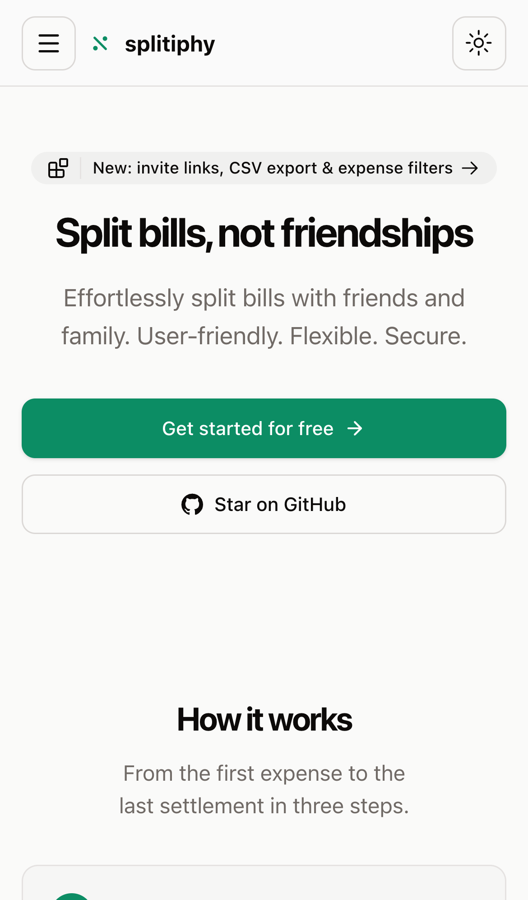

# Splitiphy - manage expenses easily

<picture>
  <source media="(prefers-color-scheme: dark)" srcset="./public/screenshots/landing-dark.png">
  
</picture>

Splitiphy is a modern full-stack web application for splitting bills with friends and family. It is built with Next.js, Tailwind CSS, Clerk and Drizzle ORM on Postgres.

## Preview Link

✅ [splitiphy.vercel.app](https://splitiphy.vercel.app/)

## Screenshots

| Mobile | Link preview |
| --- | --- |
|  |  |

## Features

- 👥 **Groups**: create groups, add members by search, or share an invite link
- 💸 **Expenses**: add, edit and delete expenses with custom splits and multiple payers
- 🧮 **Simplify debts**: collapse everyone's balances into the fewest possible payments
- 🤝 **Settle up**: record settlements between members
- 🔎 **Search & filter**: find expenses by text, category and date range
- 📄 **CSV export**: download a group's expenses and splits for spreadsheets
- 📊 **Dashboard**: yearly spending chart across all your groups
- 🌗 **Themes**: light and dark mode, with a currency preference per user

## Tech Stack

- [Next.js 16](https://nextjs.org/) (App Router, Server Actions) + React 19
- [Clerk](https://clerk.com/) for authentication
- [Drizzle ORM](https://orm.drizzle.team/) + [Neon](https://neon.tech/) serverless Postgres
- [Tailwind CSS 4](https://tailwindcss.com/) + [shadcn/ui](https://ui.shadcn.com/)
- Deployed on [Vercel](https://vercel.com/)

## Run Locally

### Prerequisites

- Node.js 22 or newer (24 recommended, see `.nvmrc`)
- [pnpm](https://pnpm.io/)
- A Clerk application and a Postgres database (for example, Neon)

### Steps

1. Clone the repository

   ```bash
   git clone https://github.com/iamsomraj/splitiphy.git
   cd splitiphy
   ```

2. Set up environment variables by copying `.env.example` to `.env` and filling in:

   - `NEXT_PUBLIC_CLERK_PUBLISHABLE_KEY` - Clerk publishable key
   - `CLERK_SECRET_KEY` - Clerk secret key
   - `DATABASE_URL` - Postgres connection string

3. Install dependencies

   ```bash
   pnpm install
   ```

4. Create the database tables

   ```bash
   pnpm db:migrate
   ```

5. Run the application

   ```bash
   pnpm dev
   ```

## Scripts

| Script             | Description                                      |
| ------------------ | ------------------------------------------------ |
| `pnpm dev`         | Start the development server                     |
| `pnpm build`       | Create a production build                        |
| `pnpm start`       | Serve the production build                       |
| `pnpm lint`        | Lint the project with ESLint                     |
| `pnpm fix`         | Lint and auto-fix problems                       |
| `pnpm format`      | Format sources with Prettier                     |
| `pnpm typecheck`   | Type-check with TypeScript                       |
| `pnpm db:generate` | Generate a SQL migration from `src/db/schema.ts` |
| `pnpm db:migrate`  | Apply pending migrations to `DATABASE_URL`       |
| `pnpm db:push`     | Push the schema directly (prototyping only)      |
| `pnpm db:studio`   | Open Drizzle Studio                              |

## Deployment

The app deploys to Vercel with zero configuration. Set the three environment variables above in the Vercel project (Production and Preview), and run `pnpm db:migrate` against the production database whenever a new migration is added under `drizzle/`.

## Developer

LinkedIn : [iamsomraj](https://www.linkedin.com/in/iamsomraj/) 😊

Portfolio: [Somraj Mukherjee](https://iamsomraj.github.io/) 😊

## Show Your Support

Give me a star ⭐

if this project helped you 👦 👧

## License

[GNU General Public License v3.0](https://www.gnu.org/licenses/gpl-3.0.html)
